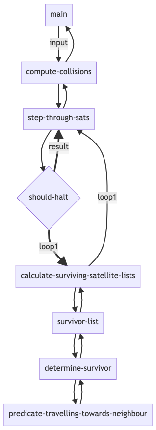

# Code Challenge - Satellites 

Common Lisp, SBCL compiler.

## Setup
```
brew install sbcl
chmod +x satellites.lisp
./satellites.lisp
```

## Program output

```
[jacobclark:~/workspace/cc-satelites]$ ./satelites.lisp
(-3 -2 3)
(-2 -1 1 2)
(-2 -2)
(-2 -2)
(10)
NIL
```

