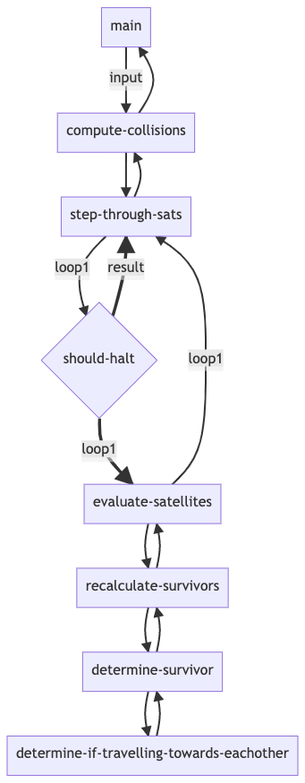

# Code Challenge - Satellites 

Common Lisp, SBCL compiler.

## Setup
```
brew install sbcl
chmod +x satellites.lisp
./satellites.lisp
```

## Program output

```
[jacobclark:~/workspace/cc-satelites]$ ./satelites.lisp
"Input: "(-3 1 1 -2 3 -2)" - Result: "(-3 -2 3)
"Input: "(-2 -1 1 2)" - Result: "(-2 -1 1 2)
"Input: "(-2 1 1 -2)" - Result: "(-2 -2)
"Input: "(1 1 -2 -2)" - Result: "(-2 -2)
"Input: "(10 2 -5)" - Result: "(10)
"Input: "(8 -8)" - Result: "NIL
"Input: "(-4 2 -3 3 4 -1 2 -2 3 -4)" - Result: "(-4 -3 3)
"Input: "(5 -2 -5 -2 3 -1 -1 3 -4)" - Result: "(-2 -4)
"Input: "(1 -1 1 1 -1 -1 1 -1)" - Result: "NIL
```



## Problem

Consider a list of satellites moving through 2D space: `[-2,-1, 1,-2]`

The absolute value of each satellite represents its size, and the sign of the satellite represents its direction of travel (- being left, + being right). If two satellites meet, the smaller satellite is destroyed. If meeting satellites are the same size, both are destroyed. All satellites are moving at the same speed.

Given this information, the challenge is to write an algorithm capable of determining the final state of these sample problems after all collisions have taken place:

```
[-4,2,-3,3,4,-1,2,-2,3,-4]
[5,-2,-5,-2,3,-1,-1,3,-4]
[1,-1,1,1,-1,-1,1,-1]
```

Example:
For the following list of satellites: `[-3, 1, 1,-2, 3,-2]`
The expected output after all collisions is: `[-3,-2, 3]`